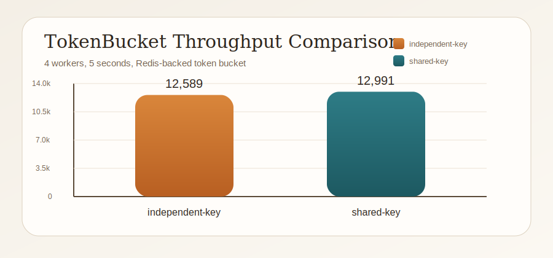
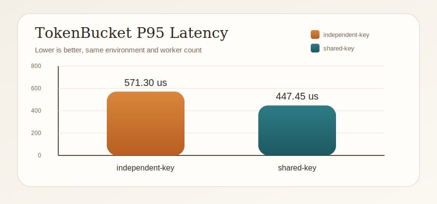
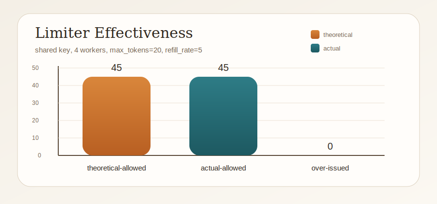
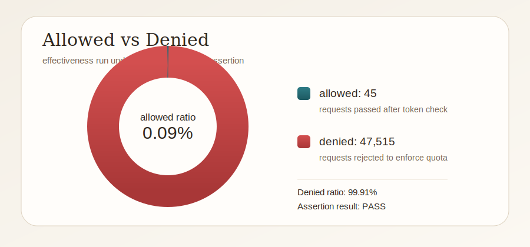

# Redis 分布式限流组件

一个基于 `C++17 + hiredis + pybind11` 实现的轻量级分布式限流组件。

项目核心目标是把原本只能在单机内存中工作的限流逻辑，升级为**多实例共享配额**的分布式方案，并且能够直接接入 Python 服务。

适合作为：

- 后端中间件练手项目
- Python 服务的分布式限流组件
- 校招 / 实习 / 秋招简历项目
- 学习 Redis 原子操作、Lua 脚本、C++ 封装和 Python 绑定的综合项目

## 快速导航

- [项目简介](#1-项目简介)
- [项目亮点](#2-项目亮点)
- [项目整体结构](#4-项目整体结构)
- [核心模块说明](#6-核心模块说明)
- [调用流程](#8-调用流程)
- [构建方式](#11-构建方式)
- [Python 使用示例](#12-python-使用示例)
- [新增功能](#123-新增功能)
- [功能验证](#124-功能验证)
- [压测](#125-压测)
- [测试与压测结果](#126-测试与压测结果)
- [FastAPI Demo](#127-fastapi-demo)
- [CI](#128-ci)
- [架构图](#129-架构图)
- [简历描述](#1210-简历描述)
- [Benchmark Report](#1211-benchmark-report)
- [Prometheus 与 Grafana](#1212-prometheus-与-grafana)

## 快速开始

1. 安装依赖：`cmake`、`hiredis`、Python 3、`pybind11`
2. 编译扩展模块：

```bash
cmake -S . -B build \
  -Dpybind11_DIR="$(python3 -c 'import pybind11; print(pybind11.get_cmake_dir())')"
cmake --build build
```

3. 在 Python 中导入 `redis_limiter` 并创建限流器

---

## 1. 项目简介

在后端服务中，限流是很常见的基础能力，比如：

- 登录接口防刷
- 短信验证码发送频率限制
- API 请求流量控制
- 某类资源访问频率约束

如果只用本地内存做限流，那么单机部署时问题不大；但一旦服务变成多实例部署，每台机器都会维护一份自己的计数，最终会出现：

- 每台机器都认为自己“没超限”
- 实际总请求数超过原本想要控制的阈值

这个项目就是为了解决这个问题。

它将限流状态放到 Redis 中，由多个实例共享同一份额度，同时通过 `pybind11` 暴露给 Python 使用，适合作为 Python 后端服务的限流组件。

---

## 2. 项目亮点

- 基于 Redis 作为中心状态存储，实现多实例共享限流配额
- 基于 Lua 脚本封装 Redis 原子操作，保证并发场景下状态更新一致性
- 使用 C++ 封装 Redis 连接池，降低频繁建连带来的开销
- 同时实现滑动窗口和令牌桶两种限流算法，便于对比不同场景下的策略选择
- 通过 `pybind11` 提供 Python 调用接口，方便接入 Python 服务
- 提供 Redis 故障降级方案，在 Redis 不可用时支持本地限流、放行或拒绝
- 提供 FastAPI demo、Prometheus 风格指标、`pytest`、CI 和压测断言，形成完整工程闭环

---

## 3. 适用场景

适合下面这类场景：

- Python Web 服务的接口限流
- 多实例部署下需要共享额度的接口控制
- 后端中间件项目练手
- 校招 / 实习 / 秋招简历项目
- 想把 Redis、C++、Python 绑定、分布式限流几个点串成一个完整项目

---

## 4. 项目整体结构

```text
.
├── CMakeLists.txt
├── README.md
├── docker-compose.yml
├── requirements.txt
├── include/
│   ├── redis_pool.hpp
│   └── sliding_window_limiter.hpp
├── src/
│   ├── redis_pool.cpp
│   ├── sliding_window_limiter.cpp
│   └── python_binding.cpp
├── .github/
│   └── workflows/
│       └── ci.yml
├── tests/
│   ├── benchmark.py
│   ├── test_integration.py
│   └── verify_functionality.py
└── examples/
    ├── fastapi_demo.py
    └── python_demo.py
```

---

## 5. 每个目录是做什么的

### `include/`

放头文件，也就是“接口声明”。

你可以把它理解成：

- 告诉别人这个项目里有哪些类
- 每个类有哪些方法
- 每个结构体里有哪些字段

主要文件：

- [include/redis_pool.hpp](/Users/mac/Desktop/redis-rate-limiter/include/redis_pool.hpp)
  负责定义 Redis 配置、连接对象、连接池、连接守卫、统计信息等
- [include/sliding_window_limiter.hpp](/Users/mac/Desktop/redis-rate-limiter/include/sliding_window_limiter.hpp)
  负责定义限流结果、滑动窗口限流器、令牌桶限流器、本地令牌桶、故障降级策略和工厂类

### `src/`

放源文件，也就是“具体实现”。

你可以把它理解成：

- 头文件里只是说“有这些功能”
- `src/` 里才是真正写这些功能怎么工作的地方

主要文件：

- [src/redis_pool.cpp](/Users/mac/Desktop/redis-rate-limiter/src/redis_pool.cpp)
  实现 Redis 连接池，包括建连、认证、选择 DB、连接复用、健康检查等
- [src/sliding_window_limiter.cpp](/Users/mac/Desktop/redis-rate-limiter/src/sliding_window_limiter.cpp)
  实现滑动窗口、Redis 令牌桶、本地令牌桶、故障降级逻辑
- [src/python_binding.cpp](/Users/mac/Desktop/redis-rate-limiter/src/python_binding.cpp)
  把 C++ 类通过 `pybind11` 暴露给 Python

### `examples/`

放 Python 调用示例。

- [examples/python_demo.py](/Users/mac/Desktop/redis-rate-limiter/examples/python_demo.py)
  演示如何从 Python 中创建 Redis 连接池并调用限流器
- [examples/fastapi_demo.py](/Users/mac/Desktop/redis-rate-limiter/examples/fastapi_demo.py)
  演示如何把限流器接入 FastAPI 接口

### `tests/`

放验证脚本和压测脚本。

- [tests/verify_functionality.py](/Users/mac/Desktop/redis-rate-limiter/tests/verify_functionality.py)
  验证 Redis 正常限流和 Redis 故障降级
- [tests/test_integration.py](/Users/mac/Desktop/redis-rate-limiter/tests/test_integration.py)
  使用 `pytest` 覆盖 Redis 令牌桶、故障降级和 FastAPI 集成
- [tests/benchmark.py](/Users/mac/Desktop/redis-rate-limiter/tests/benchmark.py)
  提供吞吐压测和限流有效性压测

### `docker-compose.yml`

定义本地 Redis、示例运行环境、测试服务和压测服务。

### `.github/workflows/ci.yml`

定义 GitHub Actions 流水线，自动执行构建、功能验证、`pytest` 和限流有效性断言。

### `prometheus/` 和 `grafana/`

定义监控抓取配置、Grafana 数据源、dashboard provisioning 和预置看板。

### `CMakeLists.txt`

项目的构建脚本，用来告诉 CMake：

- 需要编译哪些 C++ 文件
- 需要链接哪些依赖库
- 最终生成哪个 Python 扩展模块

---

## 6. 核心模块说明

## 6.1 Redis 连接池：`RedisPool`

对应文件：

- [include/redis_pool.hpp](/Users/mac/Desktop/redis-rate-limiter/include/redis_pool.hpp)
- [src/redis_pool.cpp](/Users/mac/Desktop/redis-rate-limiter/src/redis_pool.cpp)

作用：

- 维护一组可复用的 Redis 连接
- 避免每次请求都重新创建连接
- 提高性能，降低连接开销

主要能力：

- 支持连接超时和 socket 超时设置
- 支持 Redis 认证
- 支持选择 DB
- 支持健康检查
- 支持连接池大小调整
- 支持统计信息导出

这个模块体现的是**工程能力**，而不仅仅是算法能力。

---

## 6.2 滑动窗口限流：`SlidingWindowLimiter`

对应文件：

- [include/sliding_window_limiter.hpp](/Users/mac/Desktop/redis-rate-limiter/include/sliding_window_limiter.hpp)
- [src/sliding_window_limiter.cpp](/Users/mac/Desktop/redis-rate-limiter/src/sliding_window_limiter.cpp)

适合场景：

- 需要严格控制“某一时间窗口内最多多少次请求”

例如：

- 1 秒内最多允许 100 次请求

实现思路：

- 使用 Redis `ZSET` 保存请求时间戳
- 每次请求到来时先清理过期数据
- 再统计当前窗口内请求数
- 如果没有超限，则插入本次请求时间戳
- 整个过程通过 Lua 脚本保证原子性

特点：

- 语义更严格
- 更适合“窗口内请求数上限”类场景
- 一旦降级到本地实现，多实例之间的全局精度损失会更明显

---

## 6.3 令牌桶限流：`TokenBucketLimiter`

对应文件：

- [include/sliding_window_limiter.hpp](/Users/mac/Desktop/redis-rate-limiter/include/sliding_window_limiter.hpp)
- [src/sliding_window_limiter.cpp](/Users/mac/Desktop/redis-rate-limiter/src/sliding_window_limiter.cpp)

适合场景：

- 需要限制平均速率
- 允许一定程度的短时突发流量

例如：

- 桶容量 100
- 每秒补充 20 个令牌
- 请求到来时先扣令牌，令牌足够则放行

实现思路：

- Redis 中保存：
  - 当前令牌数
  - 上次补充时间
- 每次请求到来时：
  - 先根据时间差补充令牌
  - 再判断是否足够扣减
  - 最后返回剩余令牌和建议重试时间
- 整个过程通过 Lua 脚本一次完成，保证原子性

特点：

- 更适合平滑限流
- 更像真实后端项目中的常见方案
- 与故障降级组合时更自然

---

## 6.4 本地令牌桶：`LocalTokenBucketLimiter`

作用：

- 在 Redis 不可用时，作为单机内存限流兜底方案

实现思路：

- 使用进程内内存保存每个 key 的令牌状态
- 按时间补充令牌
- 只保证单机限流，不保证全局一致性

这个模块的意义在于：

- Redis 挂了，服务不至于完全裸奔
- 仍然能对单机流量做保护

---

## 6.5 故障降级包装器：`ResilientTokenBucketLimiter`

这是这个项目里最像真实工程方案的部分。

它并不是一种新的限流算法，而是对 `TokenBucketLimiter` 的工程增强。

作用：

- 正常情况下，走 Redis 分布式令牌桶
- Redis 异常时，自动按配置的策略降级

支持三种降级策略：

### `FallbackMode::LocalTokenBucket`

推荐默认值。

行为：

- Redis 正常：走分布式令牌桶
- Redis 失败：切换到本地令牌桶

优点：

- 服务还能继续跑
- 单机仍然受到流量保护
- 是可用性和保护能力之间比较平衡的方案

### `FallbackMode::FailOpen`

行为：

- Redis 正常：正常限流
- Redis 失败：直接放行

适合：

- 对可用性要求很高
- Redis 挂了也不希望阻塞业务

缺点：

- Redis 挂了时相当于不再限流

### `FallbackMode::FailClosed`

行为：

- Redis 正常：正常限流
- Redis 失败：直接拒绝

适合：

- 风险控制更重要
- 宁可错杀，也不能过量放行

缺点：

- Redis 故障会直接影响业务可用性

---

## 7. 为什么默认推荐“令牌桶 + 本地降级”

这个项目里，最推荐作为主线讲解和接入的方案是：

**`ResilientTokenBucketLimiter + LocalTokenBucket`**

原因：

- 令牌桶本身更适合速率控制和流量平滑
- Redis 挂掉时，本地令牌桶是比较自然的退化方式
- 虽然失去了全局一致性，但仍能保护单机
- 比纯 `fail open` 更安全
- 比纯 `fail closed` 更可用

这也是更像真实工程项目的设计取舍。

---

## 8. 调用流程

### 8.1 正常路径

```text
Python 代码
   |
   v
pybind11 暴露的 redis_limiter 模块
   |
   v
ResilientTokenBucketLimiter / TokenBucketLimiter
   |
   v
RedisPool 获取连接
   |
   v
Redis Lua 脚本执行限流逻辑
   |
   v
返回 RateLimitResult 给 Python
```

### 8.2 Redis 故障路径

```text
Python 请求
   |
   v
ResilientTokenBucketLimiter
   |
   +--> Redis 成功 -> 返回正常分布式限流结果
   |
   +--> Redis 失败 -> 进入降级逻辑
                      |
                      +--> LocalTokenBucket
                      +--> FailOpen
                      +--> FailClosed
```

---

## 9. 对外暴露的主要类

这个项目对外暴露的主要能力包括：

- `RedisConfig`
- `RedisPool`
- `RateLimitConfig`
- `RateLimitResult`
- `SlidingWindowLimiter`
- `TokenBucketLimiter`
- `LocalTokenBucketLimiter`
- `ResilientTokenBucketLimiter`
- `FallbackMode`
- `RateLimiterFactory`

---

## 10. 构建依赖

你需要准备：

- 支持 C++17 的编译器
- `cmake`
- `hiredis`
- Python 3
- `pybind11`

---

## 11. 构建方式

如果 `pybind11` 已经安装在 Python 环境中：

```bash
cmake -S . -B build \
  -Dpybind11_DIR="$(python3 -c 'import pybind11; print(pybind11.get_cmake_dir())')"
cmake --build build
```

如果 `hiredis` 不在标准目录，还需要显式指定路径：

```bash
cmake -S . -B build \
  -Dpybind11_DIR="$(python3 -c 'import pybind11; print(pybind11.get_cmake_dir())')" \
  -DHIREDIS_INCLUDE_DIR=/path/to/include \
  -DHIREDIS_LIBRARY=/path/to/libhiredis.so
cmake --build build
```

构建完成后，会得到 Python 可导入的扩展模块：

- `redis_limiter`

---

## 12. Python 使用示例

## 12.1 基础 Redis 令牌桶

```python
import redis_limiter

cfg = redis_limiter.RedisConfig()
cfg.host = "127.0.0.1"
cfg.port = 6379
cfg.pool_size = 8

pool = redis_limiter.RedisPool(cfg)
limiter = redis_limiter.TokenBucketLimiter(
    pool,
    max_tokens=100,
    refill_rate=50.0,
)

result = limiter.allow("login:user:123")
print(result.allowed, result.remaining, result.retry_after_ms)
```

## 12.2 带故障降级的令牌桶

```python
import redis_limiter

cfg = redis_limiter.RedisConfig()
cfg.host = "127.0.0.1"
cfg.port = 6379
cfg.pool_size = 8

pool = redis_limiter.RedisPool(cfg)
remote = redis_limiter.TokenBucketLimiter(
    pool,
    max_tokens=100,
    refill_rate=20.0,
)

limiter = redis_limiter.ResilientTokenBucketLimiter(
    remote,
    redis_limiter.FallbackMode.LocalTokenBucket,
    50,
    5.0,
)

result = limiter.allow("sms:user:42")
print(result.allowed, result.remaining, result.retry_after_ms)
print(limiter.redis_error_count(), limiter.fallback_hit_count())
```

---

## 12.3 新增功能

这次补充的工程化能力包括：

- 增加 [examples/fastapi_demo.py](/Users/mac/Desktop/redis-rate-limiter/examples/fastapi_demo.py)，提供真实 HTTP 接入示例
- 增加 Docker Compose `test` 服务，可直接在容器内执行功能验证
- 增加 Docker Compose `pytest` 服务，可直接执行集成测试
- 增加 [tests/verify_functionality.py](/Users/mac/Desktop/redis-rate-limiter/tests/verify_functionality.py)，覆盖正常限流和 Redis 故障降级
- 增加 [tests/test_integration.py](/Users/mac/Desktop/redis-rate-limiter/tests/test_integration.py)，覆盖 FastAPI 接入和限流行为
- 增加 Docker Compose `bench` 服务，可直接在容器内执行压测
- 增加 [tests/benchmark.py](/Users/mac/Desktop/redis-rate-limiter/tests/benchmark.py)，支持吞吐压测和限流有效性压测
- 增加限流有效性断言能力，可直接判断是否发生超发
- 增加 [.github/workflows/ci.yml](/Users/mac/Desktop/redis-rate-limiter/.github/workflows/ci.yml)，自动执行 build、test、bench

这些能力的目标不是改限流核心逻辑，而是补齐“怎么验证它真的工作”和“怎么证明它没有超发”。

---

## 12.4 功能验证

先构建测试镜像并启动 Redis：

```bash
docker compose build
docker compose up -d redis
```

验证 Redis 正常时的令牌桶限流：

```bash
docker compose run --rm test remote
```

预期结果：

- 输出 `PASS remote token bucket`
- 前 3 次请求允许通过，第 4 次请求被拒绝
- 被拒绝的请求 `retry_after_ms > 0`

验证 Redis 故障时的本地降级：

```bash
docker compose run --rm -e REDIS_HOST=redis-unavailable test fallback
```

预期结果：

- 输出 `PASS resilient fallback`
- 本地降级路径表现为前 2 次允许，第 3 次拒绝
- `redis_error_count > 0`
- `fallback_hit_count = 3`

运行 `pytest` 集成测试：

```bash
docker compose run --rm pytest
```

覆盖范围：

- 令牌桶容量耗尽后拒绝请求
- Redis 不可用时自动进入本地降级
- FastAPI `/healthz` 和 `/rate-limit/check` 接口
- FastAPI 接口在 Redis 故障时暴露降级状态

---

## 12.5 压测

先构建镜像并启动 Redis：

```bash
docker compose build
docker compose up -d redis
```

压测分布式令牌桶吞吐：

```bash
docker compose run --rm bench --workers 4 --duration 10
```

压测同一个热点 key 的竞争场景：

```bash
docker compose run --rm bench --workers 4 --duration 10 --shared-key
```

压测限流有效性：

```bash
docker compose run --rm bench \
  --mode effectiveness \
  --workers 4 \
  --duration 10 \
  --shared-key \
  --max-tokens 20 \
  --refill-rate 5
```

压测并断言“不允许超发”：

```bash
docker compose run --rm bench \
  --mode effectiveness \
  --workers 4 \
  --duration 10 \
  --shared-key \
  --max-tokens 20 \
  --refill-rate 5 \
  --max-over-issue 0 \
  --max-over-issue-ratio 0
```

输出指标包括：

- `requests`：总请求数
- `qps`：平均吞吐
- `errors`：执行异常数
- `latency_us avg/p50/p95/p99`：采样延迟
- `theoretical_allowed`：理论最大放行数
- `actual_allowed`：实际放行数
- `over_issued`：超发量，越接近 `0` 越好
- `over_issued_ratio`：超发比例
- `denied_ratio`：拒绝比例

默认会把 `max_tokens` 和 `refill_rate` 设得很高，尽量测吞吐而不是测限流拒绝率。

---

## 12.6 测试与压测结果

下面是本仓库在 `2026-04-10` 实际跑出的结果。

### 12.6.1 功能验证结果

Redis 正常时的令牌桶验证：

```text
PASS remote token bucket
  req=1 allowed=True remaining=2 retry_after_ms=0
  req=2 allowed=True remaining=1 retry_after_ms=0
  req=3 allowed=True remaining=0 retry_after_ms=0
  req=4 allowed=False remaining=0 retry_after_ms=1999
```

结论：

- 前 3 次请求被允许
- 第 4 次请求被拒绝
- 被拒绝请求包含有效的 `retry_after_ms`
- 基础限流路径工作正常

Redis 不可用时的降级验证：

```text
PASS resilient fallback
  redis_error_count=3 fallback_hit_count=3
  req=1 allowed=True remaining=1 retry_after_ms=0
  req=2 allowed=True remaining=0 retry_after_ms=0
  req=3 allowed=False remaining=0 retry_after_ms=89983
```

结论：

- Redis 异常时成功进入本地令牌桶降级
- 降级命中次数和 Redis 错误计数符合预期
- 降级后仍然维持了单机限流保护

`pytest` 集成测试结果：

```text
5 passed in 71.06s (0:01:11)
```

结论：

- HTTP demo、基础限流、故障降级、指标导出四条主路径都已经纳入回归测试
- 当前镜像下，`pytest` 集成测试全部通过

### 12.6.2 吞吐压测结果

汇总表：

| 场景 | Workers | 时长 | 总请求数 | QPS | Avg 延迟(us) | P95(us) | P99(us) | Errors |
| --- | ---: | ---: | ---: | ---: | ---: | ---: | ---: | ---: |
| 独立 key | 4 | 5s | 62945 | 12589.00 | 316.24 | 571.30 | 823.68 | 0 |
| 热点 key | 4 | 5s | 64957 | 12991.40 | 304.11 | 447.45 | 751.25 | 0 |

QPS 对比图：



P95 延迟对比图：



4 个 worker，5 秒，独立 key：

```text
workers=4 duration_s=5.00 shared_key=False
requests=62945 allowed=62945 denied=0 errors=0 qps=12589.00
latency_us avg=316.24 p50=290.02 p95=571.30 p99=823.68
```

4 个 worker，5 秒，共享热点 key：

```text
workers=4 duration_s=5.00 shared_key=True
requests=64957 allowed=64957 denied=0 errors=0 qps=12991.40
latency_us avg=304.11 p50=295.77 p95=447.45 p99=751.25
```

结论：

- 当前容器环境下，令牌桶调用吞吐在约 `12.6k` 到 `13.0k QPS`
- 热点 key 场景下没有观察到异常错误或明显的延迟失控
- 这组压测参数主要用于看吞吐，不用于判断限流是否严格生效
- 当前这组数据里，共享热点 key 没有比独立 key 更差，说明瓶颈暂时不在 Redis key 冲突上

### 12.6.3 限流有效性压测结果

汇总表：

| 场景 | Workers | 时长 | Max Tokens | Refill Rate | 理论放行 | 实际放行 | 超发量 | 超发比例 | 拒绝率 | 断言结果 |
| --- | ---: | ---: | ---: | ---: | ---: | ---: | ---: | ---: | ---: | --- |
| 热点 key 有效性压测 | 4 | 5s | 20 | 5/s | 45.00 | 45 | 0.00 | 0.000000 | 0.9991 | PASS |

限流效果图：



请求结果占比图：



4 个 worker，5 秒，共享热点 key，`max_tokens=20`，`refill_rate=5`：

```text
workers=4 duration_s=5.00 shared_key=True
requests=47560 allowed=45 denied=47515 errors=0 qps=9512.00
effectiveness theoretical_allowed=45.00 actual_allowed=45 over_issued=0.00
effectiveness over_issued_ratio=0.000000 max_over_issue=0.00 max_over_issue_ratio=0.000000
effectiveness allowed_ratio=0.0009 denied_ratio=0.9991
PASS effectiveness assertion
latency_us avg=427.13 p50=352.07 p95=846.10 p99=1634.98
```

结论：

- 理论最大放行数为 `45`
- 实际放行数也是 `45`
- `over_issued=0.00`
- 严格断言模式返回 `PASS effectiveness assertion`
- 在高并发热点 key 压力下没有出现超发，说明 Lua + Redis 的原子扣减逻辑是有效的

这说明在上述参数下，Redis 令牌桶没有出现超发，限流有效性符合预期。

---

## 12.7 FastAPI Demo

这个 demo 的目的是把组件从“库”变成“可接入业务的服务”。

启动方式：

```bash
docker compose up -d app
```

健康检查：

```bash
curl -sS http://127.0.0.1:8000/healthz
```

请求限流接口：

```bash
curl -sS http://127.0.0.1:8000/rate-limit/check \
  -H 'Content-Type: application/json' \
  -d '{"key":"login:user:123","tokens_needed":1}'
```

接口说明：

- `GET /healthz`
  返回 Redis 是否健康、当前降级模式
- `GET /metrics`
  返回 Prometheus 风格指标，包括请求总数、允许数、拒绝数、Redis 错误数、降级次数和耗时累计
- `POST /rate-limit/check`
  返回 `allowed`、`remaining`、`retry_after_ms`、`redis_error_count`、`fallback_hit_count`

查看指标：

```bash
curl -sS http://127.0.0.1:8000/metrics
```

指标示例：

```text
demo_rate_limit_requests_total 0
demo_rate_limit_allowed_total 0
demo_rate_limit_denied_total 0
demo_redis_health 1
```

实际验证结果：

```text
{"ok":true,"redis_healthy":true,"fallback_mode":"LocalTokenBucket"}
```

这个 demo 适合在秋招里讲“我是怎么把底层限流组件接到 Python Web 服务里的”。

---

## 12.8 CI

CI 配置文件在 [.github/workflows/ci.yml](/Users/mac/Desktop/redis-rate-limiter/.github/workflows/ci.yml)，当前流水线会自动执行：

- `docker compose build`
- `docker compose run --rm test remote`
- `docker compose run --rm -e REDIS_HOST=redis-unavailable test fallback`
- `docker compose run --rm pytest`
- `docker compose run --rm bench --mode effectiveness ... --max-over-issue 0`

这部分的意义是把项目从“手工验证”提升到“提交代码就能自动验证”。

---

## 12.9 架构图

```text
                +------------------------+
                |  FastAPI Demo Service  |
                | /healthz /metrics      |
                | /rate-limit/check      |
                +-----------+------------+
                            |
                            v
                +------------------------+
                |   pybind11 bindings    |
                |   redis_limiter.so     |
                +-----------+------------+
                            |
                            v
        +---------------------------------------------+
        |              C++ Rate Limiter               |
        | SlidingWindow / TokenBucket / Resilient TB  |
        +----------------------+----------------------+
                               |
                               v
                    +----------------------+
                    |   RedisPool (C++)    |
                    | connection reuse     |
                    | health check         |
                    +----------+-----------+
                               |
                               v
                    +----------------------+
                    |        Redis         |
                    | Lua atomic scripts   |
                    +----------------------+

Redis 不可用时：
FastAPI -> ResilientTokenBucketLimiter -> LocalTokenBucket fallback
```

这张图适合面试时讲三件事：

- Python 服务怎么接入 C++ 扩展
- Lua + Redis 为什么能保证原子扣减
- Redis 异常时为什么还能保留单机限流保护

---

## 12.10 简历描述

简历版项目描述可以直接写：

- 基于 `C++17 + hiredis + Redis Lua + pybind11` 实现分布式限流组件，支持滑动窗口、令牌桶和 Redis 故障降级，并提供 Python 服务接入能力。
- 设计 `ResilientTokenBucketLimiter`，在 Redis 不可用时自动切换本地令牌桶，平衡全局一致性与服务可用性。
- 封装 FastAPI demo、`pytest` 集成测试、GitHub Actions 和 Docker Compose 验证链路，补齐从组件实现到业务接入、回归测试、性能验证的工程闭环。
- 在 4 worker、热点 key 的严格有效性压测下，理论放行 `45` 次、实际放行 `45` 次，`over_issued=0`，验证分布式限流逻辑未发生超发。

如果你想写成更短的秋招 bullet，可以压缩成：

- 实现基于 Redis Lua 的分布式限流组件，支持滑动窗口、令牌桶、Python 接入与 Redis 故障降级。
- 使用 C++ 封装 Redis 连接池并通过 pybind11 暴露给 FastAPI 服务，在热点 key 压测下验证限流无超发。
- 补齐 Docker、pytest、CI、压测断言和指标导出，形成完整的工程化中间件项目。

如果你要写在项目标题或面试开场里，可以直接用这句：

> 这是一个面向 Python 后端服务的 Redis 分布式限流中间件，核心特点是分布式共享配额、Redis 故障降级、可观测性和完整的测试压测闭环。

建议项目标签：

- `C++`
- `Redis`
- `Lua`
- `pybind11`
- `FastAPI`
- `Prometheus`
- `Grafana`
- `Docker`
- `CI/CD`

---

## 12.11 Benchmark Report

仓库内提供了一页版 benchmark report：

- [reports/benchmark-report.md](/Users/mac/Desktop/redis-rate-limiter/reports/benchmark-report.md)
- [reports/benchmark-report.html](/Users/mac/Desktop/redis-rate-limiter/reports/benchmark-report.html)

适合用途：

- 单独发给面试官看性能结果
- 做 GitHub 项目展示入口
- 截图放进简历或项目汇报材料
- 直接浏览或打印导出 PDF

---

## 12.12 Prometheus 与 Grafana

项目现在支持完整的本地可观测性链路：

- Prometheus 抓取 FastAPI `/metrics`
- Grafana 自动加载 Prometheus 数据源
- Grafana 自动加载预置 dashboard

启动方式：

```bash
docker compose up -d redis app prometheus grafana
```

访问地址：

- FastAPI: `http://127.0.0.1:8000`
- Prometheus: `http://127.0.0.1:9090`
- Grafana: `http://127.0.0.1:3000`

Grafana 默认登录：

- 用户名：`admin`
- 密码：`admin`

预置 dashboard：

- `Redis Rate Limiter Overview`

Dashboard 主要观察：

- Redis 健康状态
- 当前 fallback mode
- 每秒请求数 / 允许数 / 拒绝数
- 平均请求耗时
- Redis 错误数与降级命中次数

相关文件：

- [prometheus/prometheus.yml](/Users/mac/Desktop/redis-rate-limiter/prometheus/prometheus.yml)
- [grafana/provisioning/datasources/prometheus.yml](/Users/mac/Desktop/redis-rate-limiter/grafana/provisioning/datasources/prometheus.yml)
- [grafana/provisioning/dashboards/dashboard.yml](/Users/mac/Desktop/redis-rate-limiter/grafana/provisioning/dashboards/dashboard.yml)
- [grafana/dashboards/redis-rate-limiter-dashboard.json](/Users/mac/Desktop/redis-rate-limiter/grafana/dashboards/redis-rate-limiter-dashboard.json)

这部分的价值在于，它把“有 metrics”提升成“能看 dashboard、能做现场演示、能讲可观测性闭环”。

---

## 13. 这个项目更适合怎么讲

如果是放到 GitHub 或写进简历，最推荐的描述方式不是：

- “我实现了两个限流算法”

而是：

- “我实现了一个基于 Redis 的分布式限流组件，并支持 Python 服务接入和 Redis 故障降级”

更准确一点，可以写成：

> 基于 C++/hiredis 封装 Redis 连接池，使用 Redis Lua 实现滑动窗口和令牌桶分布式限流，通过 pybind11 暴露 Python 调用接口，并为 Redis 故障场景设计本地令牌桶降级方案。

---

## 14. 当前项目推荐主线

如果你后续要继续完善这个项目，建议主线聚焦在：

- `TokenBucketLimiter`
- `ResilientTokenBucketLimiter`
- Python 服务接入
- benchmark / 压测数据
- README 和架构说明

滑动窗口建议保留，作为补充方案和算法对比能力展示。

---

## 15. 一句话总结

这是一个面向 Python 后端服务的 Redis 分布式限流组件项目，重点不只是“限流算法”，而是：

- 分布式共享配额
- Redis 原子操作
- C++ 工程封装
- Python 低成本接入
- Redis 故障降级设计

---

## 16. 开源说明

- License: [MIT](./LICENSE)
- 欢迎基于这个项目继续扩展，例如：
  - 增加 FastAPI / Flask 接入 demo
  - 增加 benchmark 压测脚本
  - 增加监控指标导出
  - 增加配置热更新
